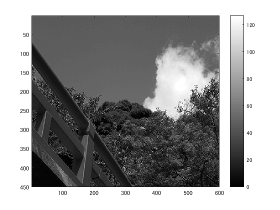
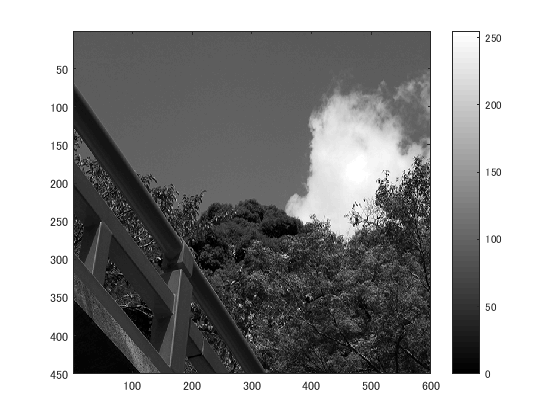

## 概要

本稿では、ダイナミックレンジをMATLABを用いて変更した。

## 使用した画像

## 結果

図１　白黒濃淡

図２

ダイナミックレンジは0から128となっている。

図３　

明るくなった。

図４

ダイナミックレンジだが変化し、0~255となっている。

## プログラムのソース

[kadai7.m](https://github.com/shimamurakie/ImageProssessing/edit/master/kadai7.m)

## 説明

## 考察

    imagesc(ORG); colormap(gray); colorbar; % 画像の表示
    pause;
    ORG = uint8(ORG); % この行について考察せよ
    imhist(ORG); % 濃度ヒストグラムを生成、表示

unit8は、変換されたORG(配列)の小数点以下の数値を丸め、8ビットの配列とする効果がある。

これを行うことで、0から255のヒストグラムに対応した数値となる。

## Contribution

## Author

[shimamurakie](https://github.com/shimamurakie)
