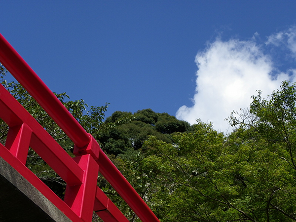
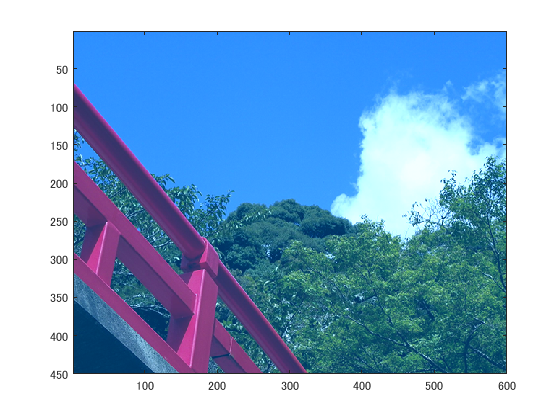

# 課題11(自由実験)

## 概要

今回の実験では、画像を読み込みフィルタを用いて着色した。
## 使用した画像

図１　hashi.png

## 結果

図2　

画像に着色がされている。

## プログラムのソース

[kadai11.m](https://github.com/shimamurakie/ImageProssessing/edit/master/kadai11.m)

## 説明

    change=zeros(x,y,z);

着色を行うためのフィルタを定義している。

    imagedata=imagedata+change;

ここで、フィルタを加算し着色した。

## 考察

授業では白黒濃淡画像を用いた実験が多かったので、カラー画像を用いた実験を行った。
フィルタを作成し加算することでMATLAB上でも色の変換が行えることを理解した。

## Author

[shimamurakie](https://github.com/shimamurakie)
