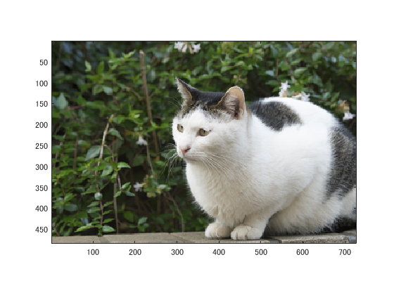
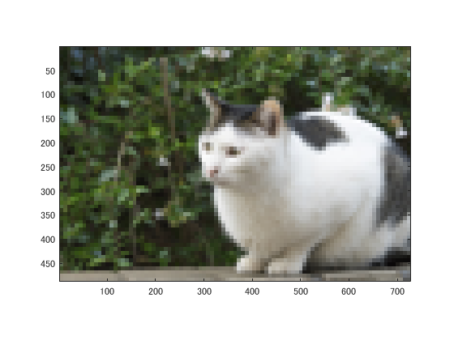
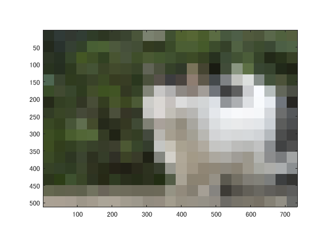
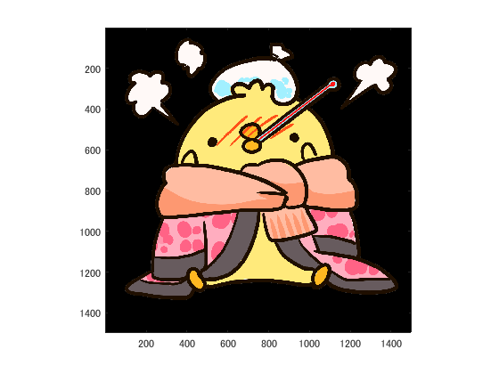
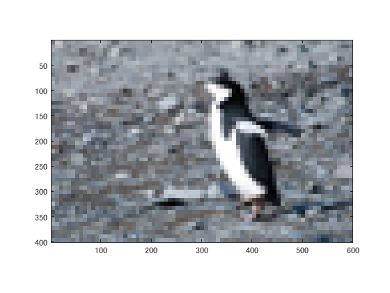
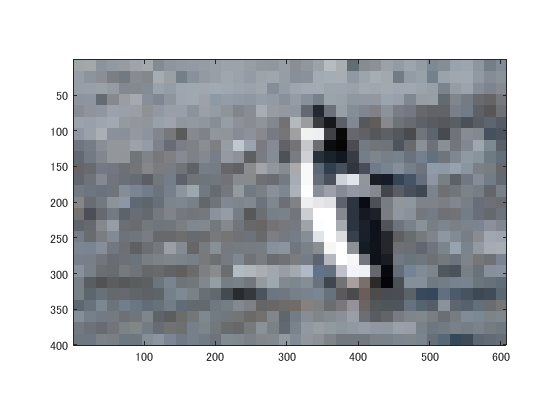
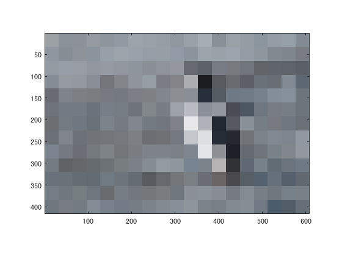

課題1
====

## 概要

本稿では、白黒濃淡画像にしたのち、２・４・８段階画像に変換した。

## 使用した画像

## 結果

図１ 1段階目

図２　２段階目

図３　３段階目

図４　４段階目

図５　5段階目

図１ 6段階目

### 別の画像での実験

pengu.png

図１ 1段階目

図２　２段階目

図３　３段階目

図４　４段階目

図５　5段階目

図１ 6段階目

## プログラムのソース

[kadai1.m](https://github.com/shimamurakie/ImageProssessing/blob/master/kadai1.m)

## 説明

## 考察

画像を一旦縮小し、再度拡大することでダウンサンプリングを行った。
６段階目になると被写体が何であるかを区別することは困難であるといえる。

## Contribution

## Author

[shimamurakie](https://github.com/shimamurakie)
