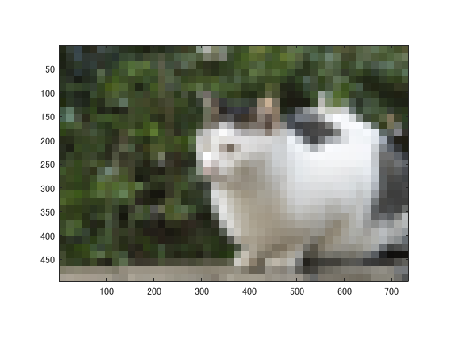
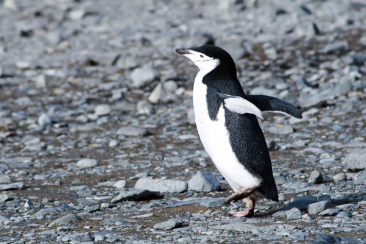
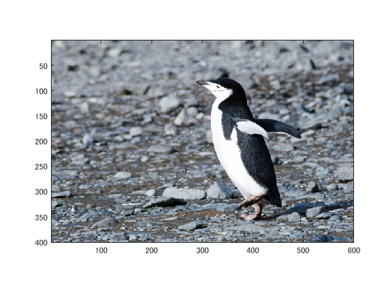

課題1
====

## 概要
今回の実験では、画像のダウンサンプリングを行った。

## 使用した画像

## 結果

図１ 1段階目

図２　２段階目

図３　３段階目

図４　４段階目

図５　5段階目

図６ 6段階目

画像が段階を踏んで荒くなっている。

### 別の画像での実験

pengu.png

図７ 1段階目

図８　２段階目

図９　３段階目

図１０　４段階目

図１１　5段階目

図１２　 6段階目

## プログラムのソース

[kadai1.m](https://github.com/shimamurakie/ImageProssessing/blob/master/kadai1.m)

## 説明

## 考察

画像を一旦縮小し、再度拡大することでダウンサンプリングを行った。
ダウンサンプリングとは、サンプリング周波数を低くして再度サンプリングを行うことである。これにより、画像の解像度が低下し、モザイクのかかったような画像となった。

６段階目になると被写体が何であるかを区別することは困難であるといえる。

## Author

[shimamurakie](https://github.com/shimamurakie)
