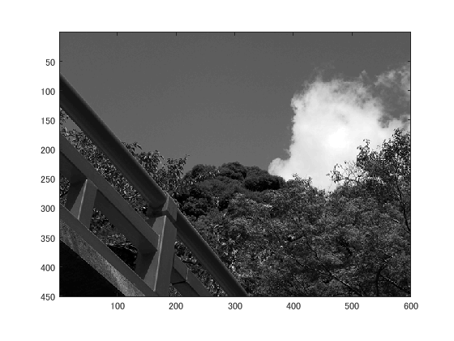
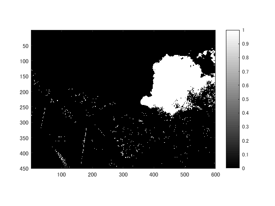
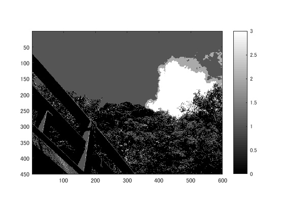
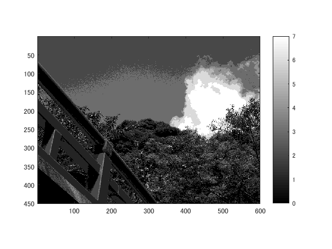
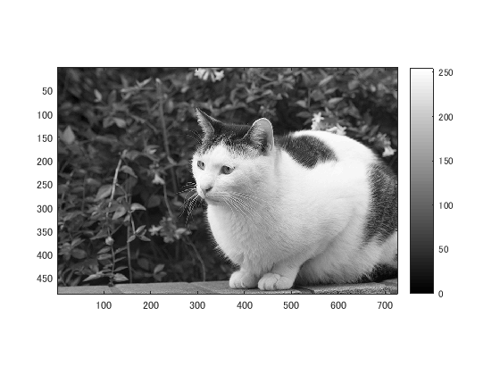
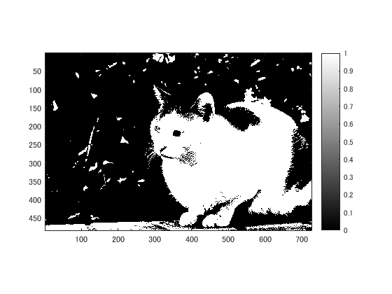
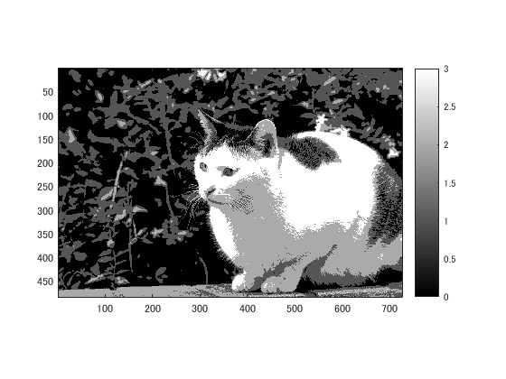
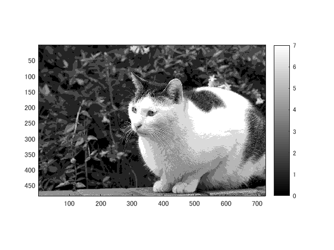

課題２
====

## 概要

今回の実験では、白黒濃淡画像にしたのち、２・４・８段階画像に変換した。

## 使用した画像

## 結果

図１ 白黒濃淡画像

図２　２段階調

図３　4段階調

図４　8段階調

### 別の画像での実験

図５　nuko.png

図６ 白黒濃淡画像

図７　２段階調

図８　4段階調

図９　8段階調

## プログラムのソース

[kadai2.m](https://github.com/shimamurakie/ImageProssessing/blob/master/kadai2.m)

## 8段階表示の説明

    IMG0 = ORG>32;
    IMG1 = ORG>64;
    IMG2 = ORG>96;
    IMG3 = ORG>128;
    IMG4 = ORG>160;
    IMG5 = ORG>192;
    IMG6 = ORG>224;
    IMG = IMG0 + IMG1 + IMG2 + IMG3 + IMG4 + IMG5 + IMG6;

輝度値32から224まで、32ごとに閾値をとって2値化し、最後に加算して表示した。

## 考察

どちらの画像においても、8段階画像で被写体が識別可能となる状態になっている。

このようにしてポスタリゼーションを行うことで、画像のサイズを小さくすることができる。

## Author

[shimamurakie](https://github.com/shimamurakie)
