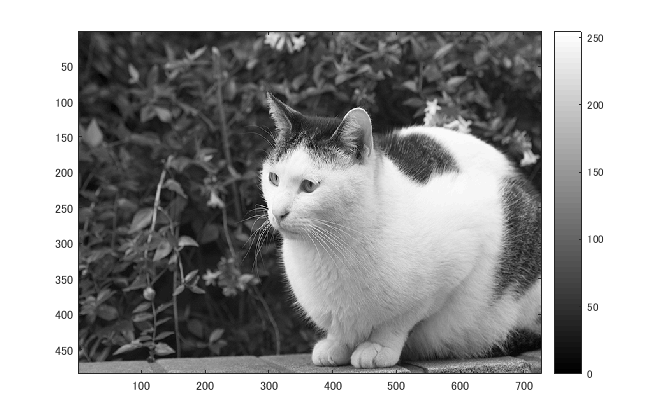
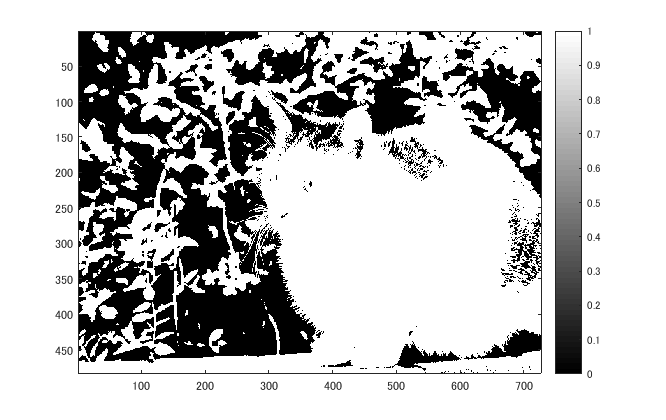
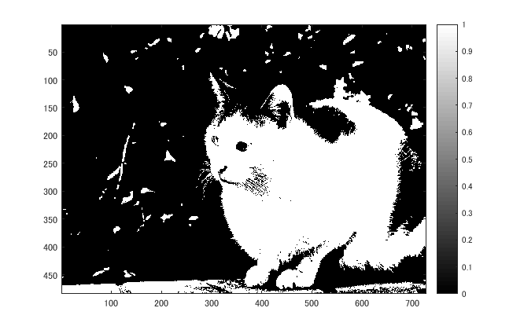
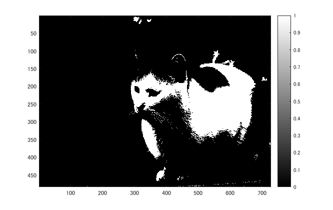
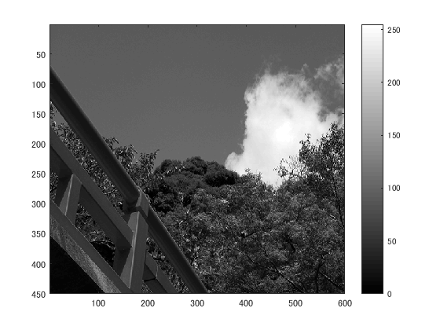
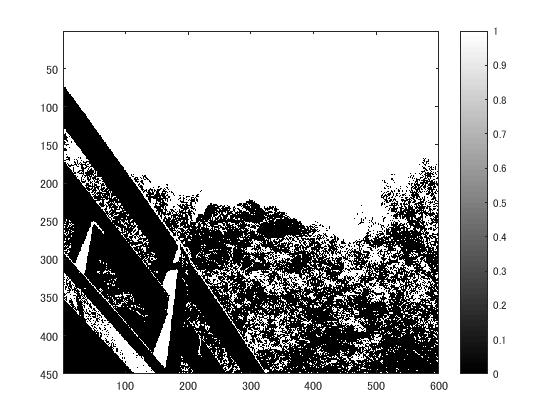
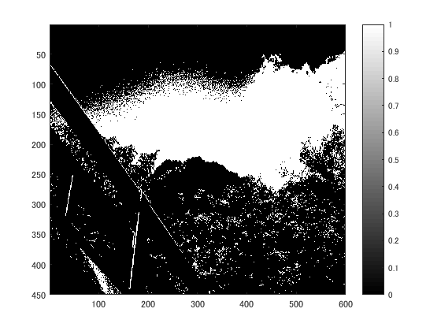
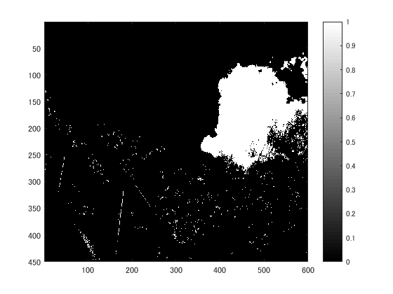
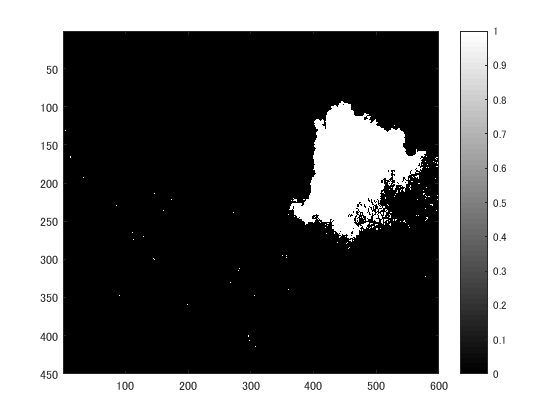

## 概要

今回の実験では、複数の閾値を用いて画像を2値化した。

## 使用した画像

## 結果

図１　白黒濃淡画像

図２ 閾値64

図3　閾値96

図4 閾値128

図5　閾値192

### 他の画像で試した

図6　hashi.png

図7 白黒濃淡画像

図8 閾値64

図9 閾値96

図10 閾値128

図11 閾値192

## プログラムのソース

[kadai3.m](https://github.com/shimamurakie/ImageProssessing/blob/master/kadai3.m)

## 説明

## 考察

本稿では、決められた数値を閾値として設定した2値化を行った。
2値化とは、設定された閾値と画素の濃度値を比較し、閾値より大きければ1(白)、閾値より小さければ0(黒)とする機能である。

nuko.pngは猫の輪郭がはっきりしていないせいか、どの閾値をとっても画像が不明瞭となってしまった。

一方hashi.pngでは輝度のバランスが良く、木の葉による影ご細かいことから64の閾値でくっきりとした画像となった。

## Contribution

## Author

[shimamurakie](https://github.com/shimamurakie)
