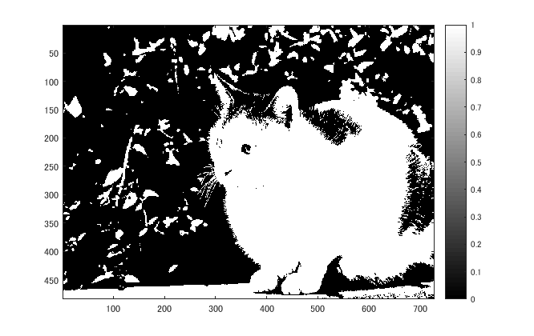
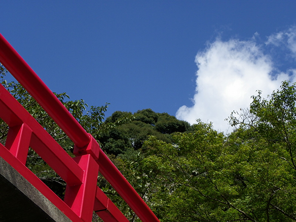

## 概要

本稿では、ダイナミックレンジをMATLABを用いて変更した。

## 使用した画像

## 結果

図１　白黒濃淡

図２ 64

図3　96

図4 128

図5　192

### 他の画像で試した

図6　hashi.png

図7 白黒濃淡

図8 64

図9 96

図10 128

図11 192

## プログラムのソース

[kadai3.m](https://github.com/shimamurakie/ImageProssessing/blob/master/kadai3.m)

## 説明

## 考察
nuko.pngは猫の輪郭がはっきりしていないせいか、どの閾値をとっても画像が不明瞭となってしまった。

一方hashi.pngでは輝度のバランスが良く、木の葉による影ご細かいことから64の閾値でくっきりとした画像となった。

## Contribution

## Author

[shimamurakie](https://github.com/shimamurakie)
