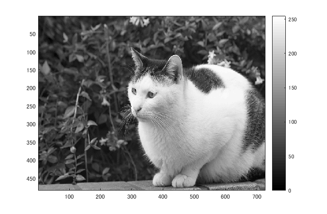
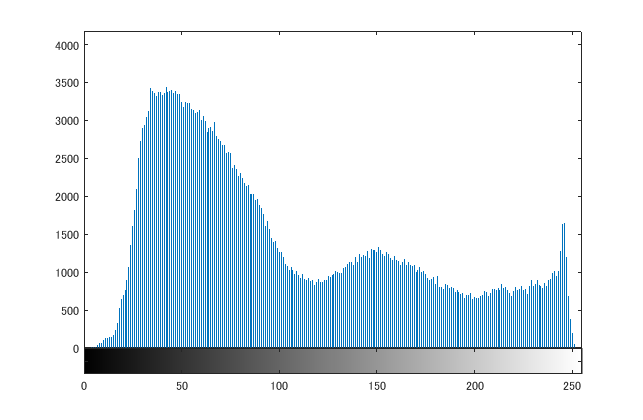
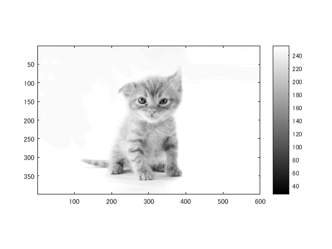
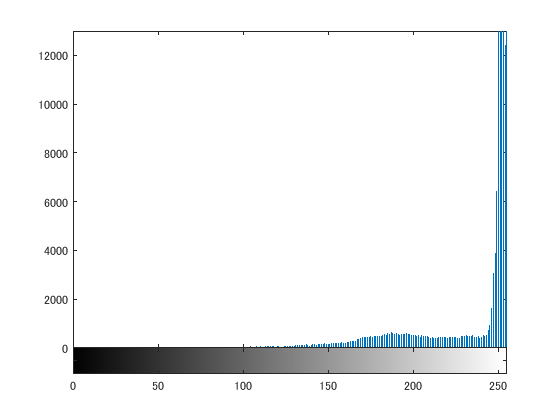

## 概要

本稿では、ダイナミックレンジをMATLABを用いて変更した。

## 使用した画像

## 結果

図１　白黒濃淡

図２

neko.pngの輝度値ヒストグラムが表示された。

### 他の画像で試した

図５　nekoc.png

図６

図７

## プログラムのソース

[kadai4.m](https://github.com/shimamurakie/ImageProssessing/blob/master/kadai4.m)

## 説明

## 考察
nuko.pngでは草が影となっている部分が多く、ヒストグラムも輝度の低い数値に濃度値が集中した。
一方nekoc.pngでは背景が白であったこと、猫の画像も明度を高くしてあったことから、ヒストグラムも輝度が255のあたりに集中した。

## Contribution

## Author

[shimamurakie](https://github.com/shimamurakie)
