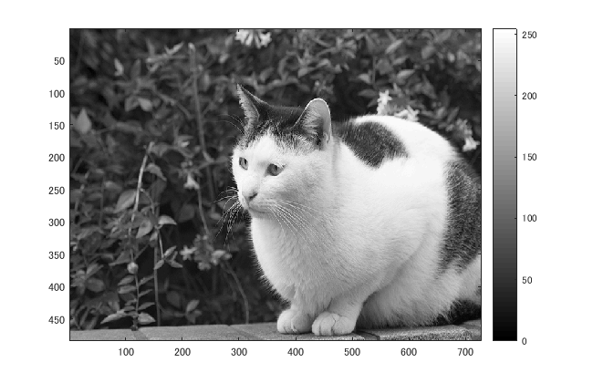
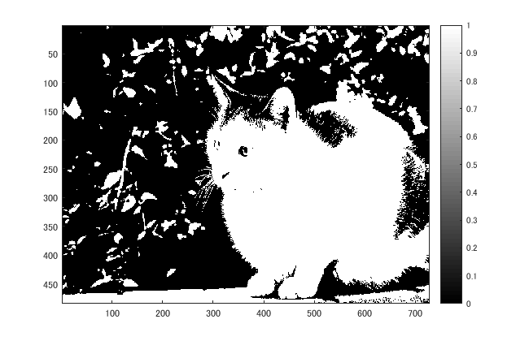
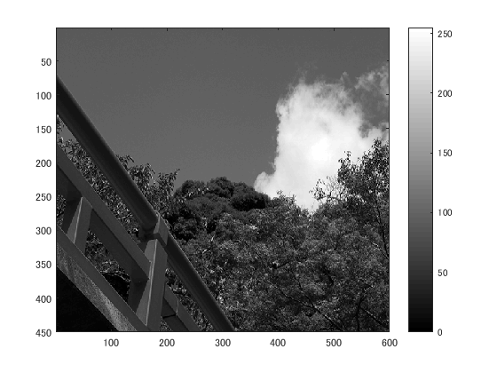
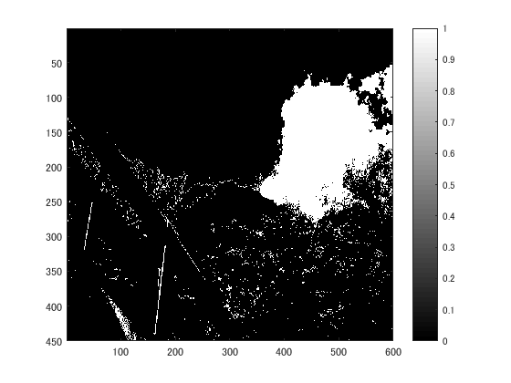

## 概要

本稿では、判別分析法を用いて画像二値化した．

## 使用した画像

## 結果

図１　白黒濃淡

図２

猫の輪郭が分かるように2値化されている。

### 他の画像で実験

図３　hashi.png

図４

図5

## プログラムのソース

[kadai5.m](https://github.com/shimamurakie/ImageProssessing/blob/master/kadai5.m)

## 説明

## 考察

画像から分離度を算出し、自動的に閾値を決定して二値化処理を行う手法である。

この手法は、多くの画像処理ソフトやOpenCVにも実装されている。

## Contribution

## Author

[shimamurakie](https://github.com/shimamurakie)
