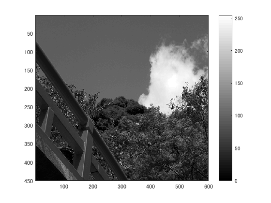
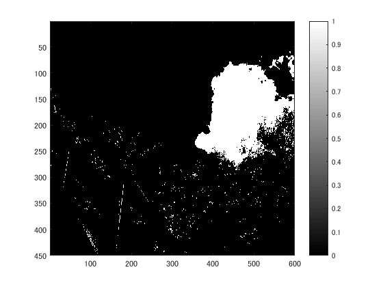
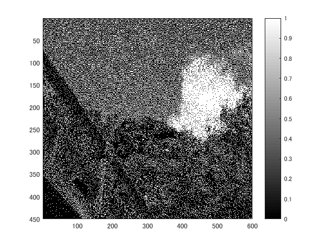

## 課題６　画像の二値化
下記のプログラムを参考にして画像を二値化せよ．

下記はサンプルプログラムである．
課題作成にあたっては「Lenna」以外の画像を用いよ．

## 使用した画像

## 生成された画像

白黒濃淡画像にしたもの

濃度値＝128で2値化

ディザ法で2値化

## プログラムのソース

[kadai6.m](https://github.com/shimamurakie/ImageProssessing/edit/master/kadai6.m)
## 考察

濃度値128の場合、128以下のも濃度のものがすべて"0"となっているため、
濃度値の分散が大きい、あるいは平均値が128より大きく離れている場合に「見にくい」画像となることがわかった。

一方ディザ法の場合は、上記の場合と比較して「見やすい」画像となっている。

