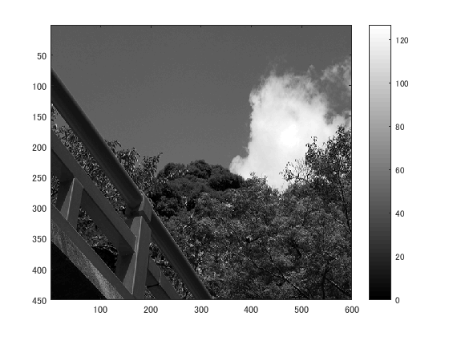
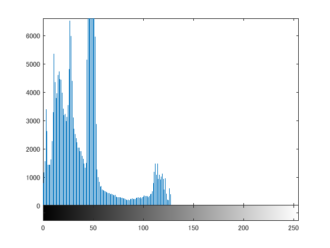
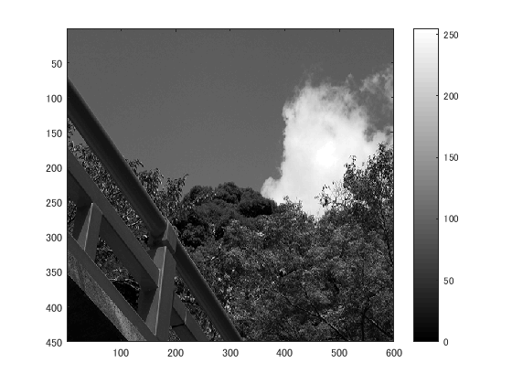

## 概要

本稿では、白黒濃淡画像にしたのち、２・４・８段階

## 使用した画像

## 結果

図１　

## プログラムのソース

[kadai2.m](https://github.com/shimamurakie/ImageProssessing/edit/master/kadai6.m)

## 説明

## 考察

## Contribution

## Author

[shimamurakie](https://github.com/shimamurakie)
