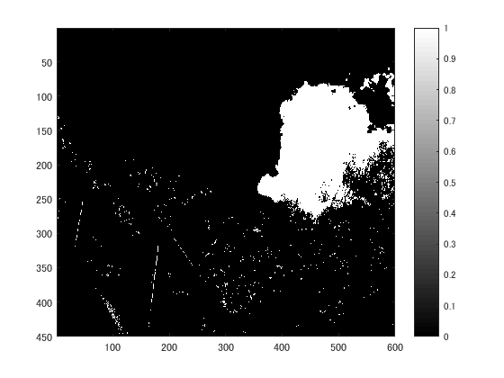
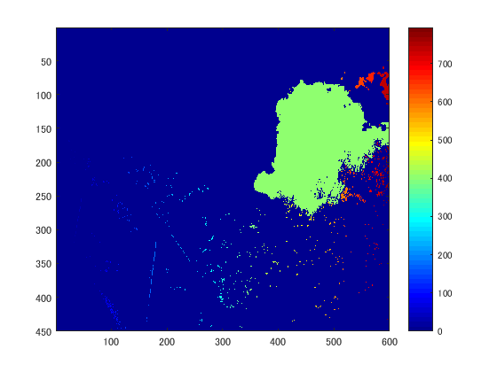
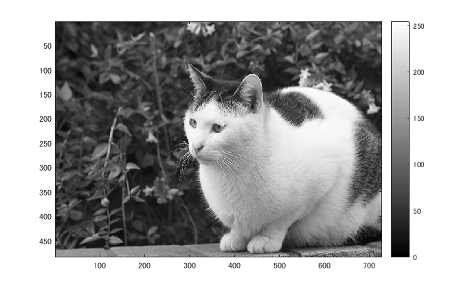
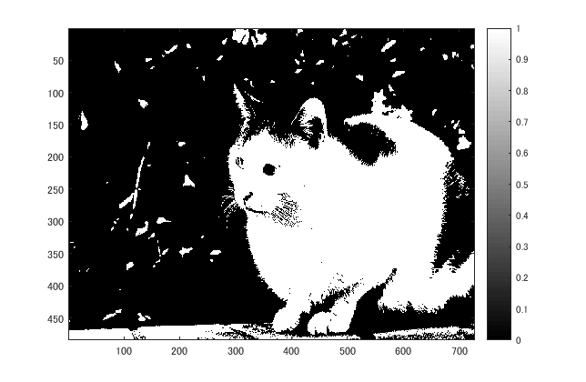
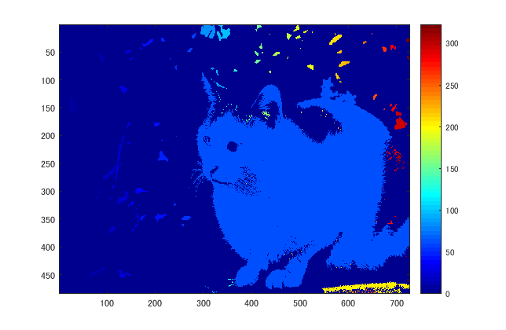

## 概要

本稿では、画像を２値化し、ラベリングを行った。

## 使用した画像

## 結果

図１　白黒濃淡

図２

128で二値化

図３　

ラベリングされている。

### 他の画像で実験

図４

図５　白黒濃淡

図６

図７　

## プログラムのソース

[kadai8.m](https://github.com/shimamurakie/ImageProssessing/edit/master/kadai8.m)

## 説明

## 考察

## Contribution

## Author

[shimamurakie](https://github.com/shimamurakie)
