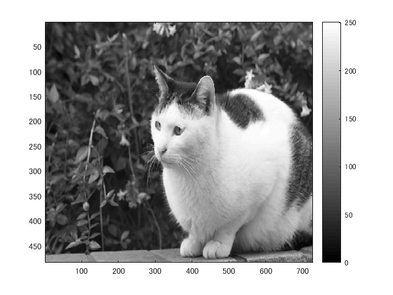

## 概要

本稿では、メディアンフィルターを適用し，ノイズ除去を体験した．

## 使用した画像

## 結果

図１　白黒濃淡

図２

ダイナミックレンジは0から128となっている。

図３　

明るくなった。

図４

図5　

明るくなった。

図6

### 他の画像で実験

nekoc.png

明るくなった。

図７

図８　

明るくなった。

図９

図１０　

明るくなった。

図１１

図１２

## プログラムのソース

[kadai9.m](https://github.com/shimamurakie/ImageProssessing/edit/master/kadai9.m)

## 説明

## 考察

メディアンフィルタとは、

## Contribution

## Author

[shimamurakie](https://github.com/shimamurakie)
